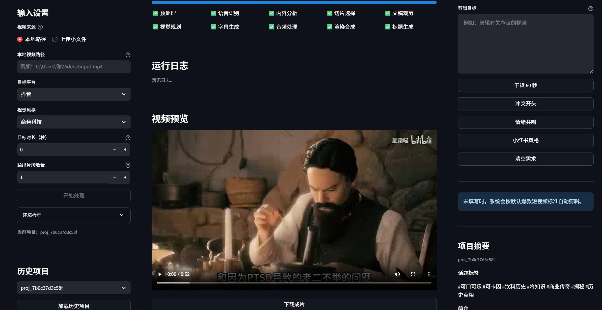

# AutoEdit

AutoEdit 是一个面向长视频的智能切片系统。它可以把直播录屏、访谈、课程、讲座等长视频，自动处理成带字幕、标题、封面文案和话题标签的短视频片段。

当前版本提供 Streamlit 可视化页面，并支持把用户在 AI 助手中输入的自然语言剪辑需求接入剪辑 pipeline，例如：

> 剪一条关于创业失败教训的 60 秒视频，开头要有冲突感，删除闲聊和重复内容。

系统会把这类需求传入选片、文稿裁剪和标题生成环节，让成片更贴近用户意图。

## 主要功能

- **视频预处理**：使用 FFmpeg 提取音频、裁剪片段、合成最终视频。
- **语音识别**：使用 Whisper / Faster-Whisper 生成转录文本与时间轴。
- **内容分析**：使用 LLM 分析主题、章节、金句、信息密度和可传播点。
- **智能选片**：根据内容完整度、钩子强度和用户剪辑需求选择候选片段。
- **文稿裁剪**：删除闲聊、重复、跑题、废话，保留核心观点和有效表达。
- **字幕生成**：生成 ASS 字幕文件，并在渲染阶段压入视频。
- **音频处理**：支持裁剪后的音频重建与基础音频合成。
- **标题生成**：生成多类型标题、话题标签、封面文案和简介。
- **AI 剪辑需求**：用户可以用自然语言描述想剪什么，系统会把需求接入 pipeline。
- **历史项目**：页面可加载已有输出项目，查看视频、标题和摘要。

## 演示



## 技术栈

| 模块 | 技术 |
| --- | --- |
| Web 页面 | Streamlit |
| API 服务 | FastAPI |
| 工作流 | LangGraph |
| 语音识别 | Whisper / Faster-Whisper |
| 大模型 | DeepSeek / OpenAI SDK 兼容接口 |
| 视频处理 | FFmpeg |
| 配置 | `.env` + YAML |
| 存储 | 本地 `storage/` 目录 |

## 项目结构

```text
auto_edit/
├── app/
│   ├── agents/              # 各处理 Agent：选片、裁剪、字幕、标题等
│   ├── api/                 # FastAPI 路由
│   ├── prompts/             # LLM 提示词模板
│   ├── schemas/             # 数据结构定义
│   ├── services/            # FFmpeg、Whisper、LLM、字幕、存储等服务
│   ├── utils/               # 文本、时间、日志等工具
│   ├── workers/             # Celery / 同步任务封装
│   ├── workflows/           # LangGraph 主工作流
│   ├── config.py            # 项目配置
│   └── main.py              # FastAPI 入口
├── configs/                 # 平台、风格、敏感词、音效等 YAML 配置
├── docs/                    # 架构、接口、数据结构、验收标准等文档
├── storage/                 # 上传文件、输出文件、中间文件
├── web/
│   └── streamlit_app.py     # Streamlit 页面入口
├── .env.example             # 环境变量示例
├── requirements.txt         # Python 依赖
└── README.md
```

## 环境要求

- Python 3.10+
- FFmpeg，并确保 `ffmpeg` 命令可以在终端中直接运行
- DeepSeek 或其他 OpenAI SDK 兼容服务的 API Key
- Windows / macOS / Linux 均可运行，当前项目目录为 Windows 环境

检查 FFmpeg：

```bash
ffmpeg -version
```

## 安装依赖

建议使用虚拟环境：

```bash
python -m venv .venv
.venv\Scripts\activate
pip install -r requirements.txt
```

如果只使用 CPU，建议安装 CPU 版 PyTorch：

```bash
pip install torch torchaudio --index-url https://download.pytorch.org/whl/cpu
```

## 配置环境变量

复制配置示例：

```bash
copy .env.example .env
```

编辑 `.env`：

```env
LLM_PROVIDER=deepseek
LLM_MODEL=deepseek-chat
LLM_API_KEY=你的 API Key
LLM_BASE_URL=https://api.deepseek.com

WHISPER_MODEL_SIZE=tiny
WHISPER_DEVICE=cpu
WHISPER_COMPUTE_TYPE=int8
```

常用配置说明：

| 配置项 | 默认值 | 说明 |
| --- | --- | --- |
| `LLM_PROVIDER` | `deepseek` | LLM 服务商标识 |
| `LLM_MODEL` | `deepseek-chat` | 使用的模型名称 |
| `LLM_API_KEY` | 空 | LLM API Key，必须配置 |
| `LLM_BASE_URL` | `https://api.deepseek.com` | OpenAI SDK 兼容接口地址 |
| `WHISPER_MODEL_SIZE` | `tiny` | Whisper 模型大小 |
| `WHISPER_DEVICE` | `cpu` | 运行设备，支持 `cpu` / `cuda` |
| `WHISPER_COMPUTE_TYPE` | `int8` | Faster-Whisper 计算类型 |

## 启动 Streamlit 页面

推荐使用 Streamlit 页面运行完整流程：

```bash
streamlit run web/streamlit_app.py
```

页面包含三块主要区域：

- **左侧输入区**：选择视频、平台、风格、目标时长、输出数量、AI 剪辑需求。
- **中间工作区**：显示处理进度、运行日志、视频预览、标题建议和下载按钮。
- **右侧 AI 助手**：检查环境、解释结果、保存自然语言剪辑需求、展示项目摘要。

## 使用 AI 剪辑需求

你可以在左侧 `AI 剪辑需求` 输入框中写需求，也可以直接在右侧 AI 助手里输入。系统会自动把这段文字保存为本次处理参数。

示例：

```text
剪一条关于创业失败教训的 60 秒视频，开头要有冲突感，删除闲聊和重复内容。
```

```text
帮我剪成小红书风格，保留情绪共鸣强的部分，不要太硬核，标题要更像普通人的真实经历。
```

```text
只保留讲商业模式和获客方法的部分，去掉寒暄、案例铺垫和重复解释，控制在 90 秒以内。
```

该需求会影响：

- **选片阶段**：优先选择符合主题和目标的片段。
- **裁剪阶段**：按需求保留重点、删除无关内容。
- **标题阶段**：生成更贴合用户目标的标题、标签、封面文案和简介。

处理完成后，`output_package.json` 中会记录 `user_intent`，方便回看本次剪辑目标。

## 启动 FastAPI 服务

如果需要使用 HTTP API：

```bash
uvicorn app.main:app --host 0.0.0.0 --port 8000
```

健康检查：

```bash
curl http://127.0.0.1:8000/health
```

主要接口：

| 方法 | 路径 | 说明 |
| --- | --- | --- |
| `POST` | `/api/v1/upload` | 上传视频 |
| `POST` | `/api/v1/task/{project_id}/start` | 启动处理任务 |
| `GET` | `/api/v1/task/{project_id}/status` | 查询处理状态 |
| `GET` | `/api/v1/task/{project_id}/preview` | 查看候选片段预览 |
| `POST` | `/api/v1/task/{project_id}/render` | 获取渲染结果 |
| `GET` | `/api/v1/task/{project_id}/result/{clip_id}` | 获取指定片段结果 |

## 处理流程

完整 pipeline 位于 `app/workflows/slice_workflow.py`，主要步骤如下：

```text
输入视频
  ↓
1. preprocess          提取音频，准备素材
  ↓
2. asr                 Whisper 语音识别
  ↓
3. analyze             LLM 内容分析
  ↓
4. select_clip         LLM 选出候选切片
  ↓
5. trim_script         LLM 文稿裁剪并生成编辑决策
  ↓
6. generate_visuals    视觉生成占位步骤
  ↓
7. generate_subtitles  生成字幕文件
  ↓
8. plan_audio          音频处理方案
  ↓
9. render              FFmpeg 渲染成片
  ↓
10. generate_titles    标题、标签、封面文案、简介
```

## 输出目录

默认输出在 `storage/outputs/{project_id}/`：

```text
storage/outputs/{project_id}/
├── transcript.json        # 转录结果
├── analysis.json          # 内容分析结果
├── clip_plan.json         # 候选切片方案
├── edit_decision.json     # 文稿裁剪与编辑决策
├── subtitle_plan.json     # 字幕方案
├── audio_plan.json        # 音频方案
├── render_result.json     # 渲染结果
├── output_package.json    # 最终结果包
├── output.mp4             # 单片段模式下的输出视频
└── clips/                 # 批量切片输出
```

## 常见问题

### 1. 页面提示没有配置 LLM API Key

检查 `.env` 中是否填写了：

```env
LLM_API_KEY=你的 API Key
```

修改 `.env` 后需要重启 Streamlit。

### 2. FFmpeg 不可用

确保 FFmpeg 已安装，并且终端可以直接运行：

```bash
ffmpeg -version
```

### 3. Whisper 很慢

可以先使用较小模型：

```env
WHISPER_MODEL_SIZE=tiny
WHISPER_DEVICE=cpu
WHISPER_COMPUTE_TYPE=int8
```

如果有 NVIDIA GPU，可以改为：

```env
WHISPER_DEVICE=cuda
```

### 4. 大视频上传慢或失败

Streamlit 页面支持两种输入方式：

- 小视频：直接上传文件。
- 大视频：填写本地视频路径，例如 `C:\Users\你\Videos\input.mp4`。

大文件建议使用本地路径，避免浏览器上传耗时。

### 5. AI 助手是不是完整聊天机器人？

当前 AI 助手主要用于：

- 检查环境
- 解释结果
- 保存用户剪辑需求
- 展示项目摘要

它不会在聊天窗口里自由调用大模型回答所有问题，但它输入的剪辑需求会进入后续 LLM 剪辑决策。

## 开发说明

核心改动通常集中在：

- `web/streamlit_app.py`：页面交互、参数收集、AI 助手。
- `app/workflows/slice_workflow.py`：主 pipeline 编排。
- `app/agents/script_trim_agent.py`：文稿裁剪和编辑决策。
- `app/agents/title_agent.py`：标题、标签、封面文案生成。
- `app/prompts/`：各 LLM 环节提示词模板。

运行语法检查：

```bash
python -m py_compile web/streamlit_app.py app/workflows/slice_workflow.py app/agents/script_trim_agent.py app/agents/title_agent.py
```

## License

MIT
